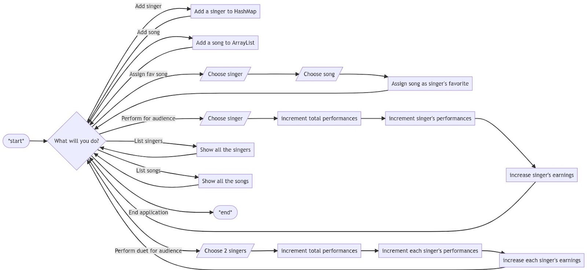

### CS4_Q1_Week5_Singer

## Task

Create a class called Singer with constructors with the following fields and methods:
- name - String
- noOfPerformances - integer
- earnings - double
- favoriteSong - Song
- performForAudience(given number of people) - increases noOfPerformances by 1 and earnings by 100 for each person (e.g. 5 people results in 500 increase)
- changeFavSong(new Song) - changes favoriteSong

1. Be able to create new instances of the Singer class.
2. Be able to assign a favorite Song to a Singer,
3. Be able to ask a singer to perform for an audience.
4. Be able to change the favorite Song of the Singer.
5. Implement conventions (access modifiers, getter/setter methods) as needed.
6. Have a static field totalPerformances to the Singer class which counts all the performances of the Singers.
7. Overload the performForAudience method such that Singers can also perform with another Singer and the profit will be split between the two of them.


## Flowchart


## Sample Run

```
Welcome to our Singer Registry System

What would you like to do?
- Add singer
- Add song
- Assign fav song
- Perform for audience
- Perform duet for audience
- List singers
- List songs
- End application

List singers

Singers:
- Taylor Swift
- Yeng Constantino
- Gabriel Valenciano
- Celeste Legaspi
- Moira Dela Torre

What would you like to do?
- Add singer
- Add song
- Assign fav song
- Perform for audience
- Perform duet for audience
- List singers
- List songs
- End application

Add singer

What is the singer's name? Jose Mari Chan
Singer Jose Mari Chan has been added to the system.

What would you like to do?
- Add singer
- Add song
- Assign fav song
- Perform for audience
- Perform duet for audience
- List singers
- List songs
- End application

List singers

Singers:
- Jose Mari Chan
- Taylor Swift
- Yeng Constantino
- Gabriel Valenciano
- Celeste Legaspi
- Moira Dela Torre

What would you like to do?
- Add singer
- Add song
- Assign fav song
- Perform for audience
- Perform duet for audience
- List singers
- List songs
- End application

List songs

ID Title Artist
0 Liwanag sa Dilim Rivermaya
1 With a Smile Eraserheads
2 Paraiso Smokey Mountain
3 Perfect True Faith
4 Ikaw lang ang aking Mahal Brownman Revival

What would you like to do?
- Add singer
- Add song
- Assign fav song
- Perform for audience
- Perform duet for audience
- List singers
- List songs
- End application

Add song

What is the song's title? Pagtingin
Who is the artist? Ben&Ben
Song Pagtingin by Ben&Ben has been added to the system.

What would you like to do?
- Add singer
- Add song
- Assign fav song
- Perform for audience
- Perform duet for audience
- List singers
- List songs
- End application

List songs

ID Title Artist
0 Liwanag sa Dilim Rivermaya
1 With a Smile Eraserheads
2 Paraiso Smokey Mountain
3 Perfect True Faith
4 Ikaw lang ang aking Mahal Brownman Revival
5 Pagtingin Ben&Ben


What would you like to do?
- Add singer
- Add song
- Assign fav song
- Perform for audience
- Perform duet for audience
- List singers
- List songs
- End application

Perform for audience

Singers:
- Taylor Swift
- Yeng Constantino
- Gabriel Valenciano
- Celeste Legaspi
- Moira Dela Torre

Enter the name of the singer: Taylor Swift
Enter number of audience: 5000
Taylor Swift has performed 1 time(s) and has earned 500000.0 pesos.
The total performance count is now at 1.

What would you like to do?
- Add singer
- Add song
- Assign fav song
- Perform for audience
- Perform duet for audience
- List singers
- List songs
- End application

Perform duet for audience

Singers:
- Taylor Swift
- Yeng Constantino
- Gabriel Valenciano
- Celeste Legaspi
- Moira Dela Torre

Enter the name of the 1st performer: Taylor Swift
Enter the name of the 2nd performer: Gabriel Valenciano
Enter number of audience: 10000
Taylor Swift has performed 2 and has earned 1000000.0 pesos.
Gabriel Valenciano has performed 1 and has earned 500000.0 pesos.
The total performance count is now at 2.

What would you like to do?
- Add singer
- Add song
- Assign fav song
- Perform for audience
- Perform duet for audience
- List singers
- List songs
- End application

End application
```
